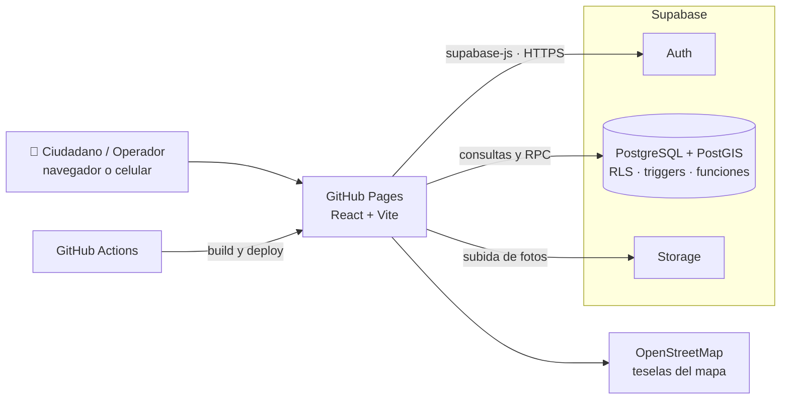
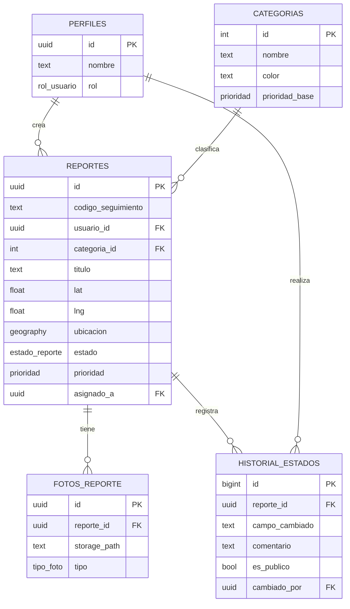
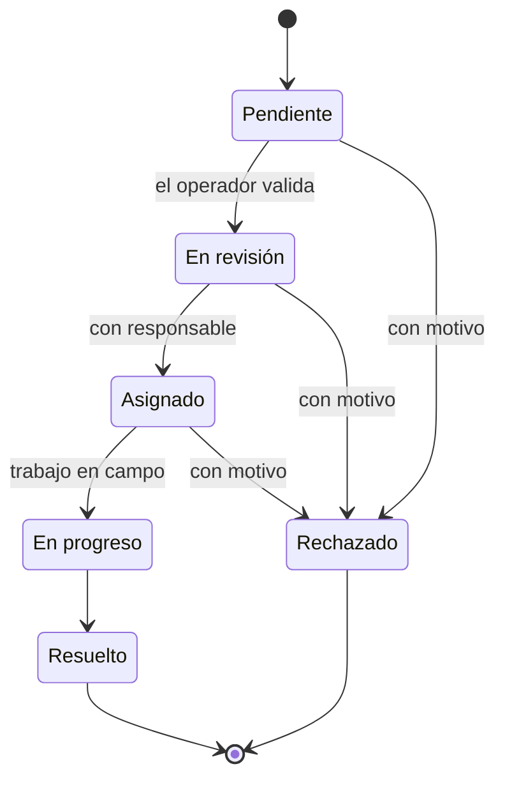

# 🏙️ Reportes Ciudadanos · Gestión de Incidencias Urbanas

Plataforma web para que los ciudadanos **reporten incidencias urbanas** (baches, luminarias dañadas, fugas de agua, basura acumulada) con **ubicación en el mapa y fotos**, y para que el municipio las **gestione, priorice y resuelva** con un historial auditable.

[](https://github.com/Danikareyes/gestion-incidencias-ciudadanas/actions/workflows/deploy.yml)


### 🔗 [Ver la demo en vivo](https://danikareyes.github.io/gestion-incidencias-ciudadanas/)

| Rol | Correo | Contraseña |
| --- | --- | --- |
| Ciudadano | `[correo-demo-ciudadano]` | `[contraseña]` |
| Operador municipal | `[correo-demo-operador]` | `[contraseña]` |

> También puedes crear tu propia cuenta de ciudadano desde la opción **Entrar → Regístrate**.

---

## 📸 Capturas

| Mapa público | Reportar incidencia |
| --- | --- |
|  |  |

| Seguimiento del reporte | Panel municipal |
| --- | --- |
|  |  |

---

## 🎯 Problemática

En muchas ciudades, los problemas del espacio público se reportan por canales dispersos (llamadas, redes sociales, visitas presenciales) que no dejan registro ni permiten dar seguimiento. El ciudadano no sabe si su reporte fue atendido, y el municipio no cuenta con información ordenada para priorizar recursos.

**Reportes Ciudadanos** centraliza ese proceso: cada reporte tiene ubicación exacta, evidencia fotográfica, un código de seguimiento público y un historial de cada cambio de estado.

---

## ✨ Funcionalidades

### Para el ciudadano
- **Mapa público** con todas las incidencias, coloreadas por categoría y con filtros.
- **Reporte en tres pasos:** ubicación (GPS o selección en el mapa), detalles y hasta 3 fotos.
- **Fotos optimizadas y privadas:** se comprimen en el navegador y se eliminan sus metadatos EXIF, que podrían revelar la ubicación de la casa del usuario.
- **Código de seguimiento** (`RPT-2026-000123`) para consultar el estado sin iniciar sesión.
- **Mis reportes:** listado con fotos, estado y línea de tiempo de cada reporte.
- Registro, inicio de sesión y **recuperación de contraseña** por correo.

### Para el municipio
- **Panel de gestión** con filtros por estado, prioridad, categoría y texto; paginación y filtros guardados en la URL.
- **Ciclo de vida controlado:** solo se permiten transiciones válidas (por ejemplo, un reporte no puede pasar de *pendiente* a *resuelto* directamente).
- Cambio de **prioridad**, **categoría** y **asignación** a un operador responsable.
- **Historial auditable** e inmutable: quién cambió qué y cuándo, con comentarios públicos o internos.
- Alerta de reportes **vencidos** (más de 7 días sin atención).

---

## 🛠️ Tecnologías

| Capa | Tecnología | Uso |
| --- | --- | --- |
| Frontend | React · TypeScript · Vite | Aplicación SPA tipada |
| Estilos | Tailwind CSS | Diseño responsive, mobile-first |
| Navegación | React Router (HashRouter) | Rutas compatibles con GitHub Pages |
| Mapas | Leaflet · React Leaflet · OpenStreetMap | Mapas sin costo ni API key |
| Backend (BaaS) | Supabase | Autenticación, API y almacenamiento |
| Base de datos | PostgreSQL + PostGIS | Datos relacionales y geográficos |
| Seguridad | Row Level Security (RLS) | Permisos por rol dentro de la base de datos |
| Archivos | Supabase Storage | Fotos de los reportes |
| CI/CD | GitHub Actions → GitHub Pages | Despliegue automático en cada push |

**Costo de infraestructura: USD 0**, usando únicamente planes gratuitos.

---

## 🏗️ Arquitectura

La aplicación no tiene un servidor propio: el frontend estático se comunica directamente con Supabase, y **toda la lógica sensible vive en PostgreSQL** (políticas RLS, triggers y funciones), de modo que la seguridad no depende del navegador.



### Modelo de datos



### Ciclo de vida de un reporte



---

## 🔐 Seguridad

- **Row Level Security en todas las tablas:** un ciudadano solo ve sus propios reportes; los operadores ven todos; nadie puede cambiar su propio rol.
- **Cambios de estado solo mediante una función de base de datos** (`cambiar_estado_reporte`) que valida el rol, la transición y los datos obligatorios, y escribe el historial.
- **Historial inmutable:** no existe ninguna política que permita editarlo o borrarlo.
- **Mapa y seguimiento públicos sin datos personales**, mediante una vista y una función que exponen solo la información necesaria.
- **Privacidad de las fotos:** se eliminan los metadatos EXIF antes de subirlas.
- **Límite de abuso:** máximo 10 reportes por usuario cada 24 horas, validado en la base de datos.
- **Sin secretos en el código:** solo la clave pública de Supabase llega al navegador; las variables se inyectan desde GitHub Secrets.

---

## 📁 Estructura del proyecto

```
gestion-incidencias-ciudadanas/
├── .github/workflows/deploy.yml   # Build y despliegue automático
├── supabase/sql/                  # Scripts de la base de datos, en orden
│   ├── 01_estructura.sql
│   ├── 02_automatizaciones.sql
│   ├── 03_seguridad.sql
│   ├── 04_datos_iniciales.sql
│   └── 05_storage.sql
├── src/
│   ├── components/                # Layout, mapas, etiquetas, línea de tiempo…
│   ├── lib/                       # Supabase, sesión, estados, fotos, formato
│   ├── pages/                     # Una pantalla por archivo
│   │   └── admin/                 # Panel municipal
│   ├── App.tsx                    # Rutas y protección por rol
│   └── main.tsx
└── vite.config.ts
```

---

## 🚀 Ejecutar el proyecto localmente

### Requisitos
- [Node.js](https://nodejs.org/) LTS (22 o superior)
- Una cuenta gratuita en [Supabase](https://supabase.com/)

### 1. Clonar e instalar

```bash
git clone https://github.com/Danikareyes/gestion-incidencias-ciudadanas.git
cd gestion-incidencias-ciudadanas
npm install
```

### 2. Crear la base de datos

En un proyecto nuevo de Supabase, abre **SQL Editor** y ejecuta los scripts de `supabase/sql/` **en orden** (del `01` al `05`).

Luego, en **Authentication → Sign In / Providers → Email**, desactiva *Confirm email* para pruebas locales.

### 3. Configurar las variables de entorno

Crea un archivo `.env.local` en la raíz del proyecto con los datos de **Project Settings → API**:

```
VITE_SUPABASE_URL=https://tu-proyecto.supabase.co
VITE_SUPABASE_ANON_KEY=tu-clave-publica
```

### 4. Iniciar

```bash
npm run dev
```

Abre `http://localhost:5173/gestion-incidencias-ciudadanas/`.

Para convertir un usuario en administrador, ejecuta en el SQL Editor:

```sql
update public.perfiles set rol = 'admin'
where id = (select id from auth.users where email = 'tu-correo@ejemplo.com');
```

---

## ☁️ Despliegue

Cada `push` a la rama `main` ejecuta el workflow de GitHub Actions, que compila el proyecto y lo publica en GitHub Pages. Para replicarlo en un fork:

1. En **Settings → Pages**, elige **GitHub Actions** como fuente.
2. En **Settings → Secrets and variables → Actions**, crea `VITE_SUPABASE_URL` y `VITE_SUPABASE_ANON_KEY`.
3. Ajusta `base` en `vite.config.ts` al nombre de tu repositorio.

---

## 💡 Decisiones técnicas

- **Serverless con Supabase en lugar de un backend propio:** permite desplegar gratis en GitHub Pages. El reto fue trasladar la lógica de negocio a PostgreSQL con RLS, triggers y funciones `SECURITY DEFINER`, lo que además garantiza que las reglas se cumplan sin importar desde dónde se acceda a los datos.
- **Latitud y longitud como columnas normales, con la columna geográfica calculada:** el frontend trabaja con números simples y PostGIS genera automáticamente la columna `geography` indexada para consultas espaciales.
- **HashRouter:** GitHub Pages no admite reescritura de rutas; con el hash, recargar cualquier pantalla nunca devuelve un error 404.
- **Flujo PKCE en la autenticación:** hace compatibles los enlaces de recuperación de contraseña con el enrutamiento por hash.
- **Reversión manual al subir fotos:** si falla la subida de una foto, se eliminan las ya subidas y el reporte, para no dejar datos incompletos.
- **Diseño mobile-first adaptado a escritorio:** el ciudadano reporta desde la calle con su celular; el operador trabaja en computadora.

---

## 🗺️ Próximas mejoras (v1.1)

- [ ] Detección de reportes duplicados cercanos con PostGIS (`ST_DWithin`)
- [ ] Apoyos ("yo también lo veo") y prioridad automática según apoyos
- [ ] Foto de resolución obligatoria para cerrar un reporte ("antes y después")
- [ ] Dashboard con indicadores y mapa de calor
- [ ] Geocodificación automática de la dirección (Nominatim)
- [ ] Instalación como aplicación (PWA) y borrador sin conexión
- [ ] Pruebas automatizadas de políticas RLS y pruebas E2E con Playwright

---

## 📄 Documentación

El proyecto se desarrolló a partir de una **Especificación de Requisitos de Software (ERS)** basada en IEEE 830, con 39 requisitos funcionales priorizados; los 18 del MVP están implementados en esta versión.


---

## 👩‍💻 Autora

**Mariana Reyes**

- GitHub: [@Danikareyes](https://github.com/Danikareyes)
